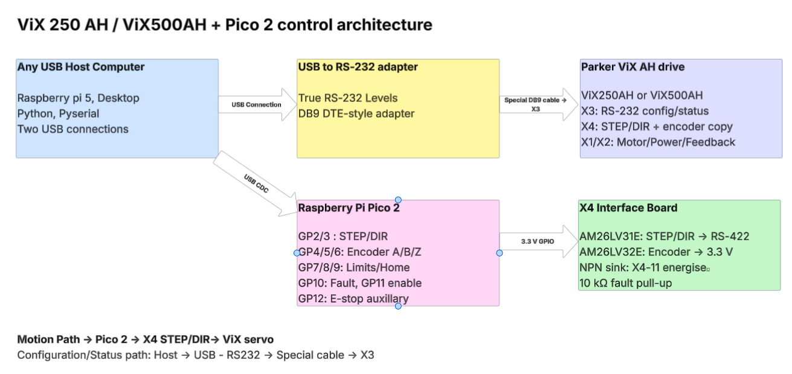

# Parker ViX250AH / ViX500AH + Raspberry Pi Pico 2 Controller

A practical, safety-oriented reference implementation for controlling a **Parker ViX250AH or ViX500AH** from a computer and a **Raspberry Pi Pico 2**.

The architecture deliberately separates configuration/status from real-time motion:

- a Raspberry Pi 5, laptop, desktop, or other USB-capable computer talks to **ViX X3 over RS-232**;
- the same computer talks to a **Pico 2 over USB**;
- the Pico 2 generates differential **STEP/DIR** for **ViX X4**, reads the X4 encoder copy, and supervises limits, ViX fault, E-stop, following error, and the X4 energise input.

This repository targets the **AH family only**. It is intended to work with both the **ViX250AH** and **ViX500AH**. Motor/encoder tuning is machine-specific; the included MX80L setup is an example, not a universal ViX tuning profile.

> **Safety:** a servo drive can move unexpectedly during setup, wiring mistakes, or controller development. Commission near the middle of travel, use a physical emergency stop, keep clear of moving hardware, and verify every input polarity before allowing motion. Do not copy the MX80L gains to a different motor/stage without validating them.



## Start here

1. Read [Hardware and wiring](docs/hardware-and-wiring.md).
2. Build the special [X3 RS-232 cable](docs/serial-x3.md).
3. Build the low-voltage [Pico 2 ↔ X4 interface](hardware/connector-pinouts.md) using the included schematic.
4. Follow [Software setup](docs/software-setup.md) to install Python/`pyserial` and flash the Pico 2.
5. Read [Safety](docs/safety.md) before energising the drive.
6. Follow [Commissioning](docs/commissioning.md) for first power-up and first controlled move.

## Repository layout

```text
ViX/
├── README.md
├── CHANGELOG.md
├── docs/                       User guide split by topic
│   └── images/                 Embedded SVG/PNG diagrams
├── hardware/
│   ├── schematic/              KiCad electrical source
│   ├── ViX_AH_Pico2_Wiring.drawio
│   ├── connector-pinouts.md
│   └── bom.md
├── datasheets/                 Parker + TI manufacturer PDFs
├── firmware/                   Pico 2 firmware
├── host/                       Simple supported Python CLI
├── scripts/                    Firmware build/upload helpers
├── tests/                      Offline checks for the cleaned repo
└── archive/commissioning-history/
                                Original v4.x development/commissioning material
```

## Hardware at a glance

For the X4 electrical interface this design uses:

- **AM26LV31E** — 3.3 V differential line driver for STEP/DIR;
- **AM26LV32E** — 3.3 V differential receiver for A/B/Z encoder copies;
- a small **NPN transistor** for fail-safe control of X4 pin 11;
- pull-ups for open-collector inputs where required.

See [the BOM](hardware/bom.md) for exact suggested parts, DigiKey Canada links, construction options, and local datasheets.

For breadboard work, the SOIC-16 ICs can be soldered to inexpensive **SOIC-16-to-DIP-16 adapter boards**. The adapters can be plugged into a breadboard, mounted on perfboard, **or used by themselves with wires soldered directly to their 0.1-inch pads**.

## X3 is not a normal straight-through DB9 cable

The ViX X3 connector uses an RS-232 pin assignment that is not the standard PC DB9 arrangement. A simple three-wire adapter cable is required.

For a typical USB-to-RS232 adapter with a male DB9 connector:

```text
USB-RS232 DB9            ViX X3
pin 3  TX   -----------> pin 4  RX
pin 2  RX   <----------- pin 5  TX
pin 5  GND  ------------ pin 3  GND
```

A convenient build uses a **female DB9 screw-terminal/breakout** at the USB-RS232 side and a **male DB9 breakout** at the ViX X3 side. See [X3 serial cable](docs/serial-x3.md) before building it; several X3 pins must intentionally remain unconnected.

## Simple host utility

Install the Python dependency:

```bash
python3 -m venv .venv
source .venv/bin/activate
python -m pip install -r requirements.txt
```

Typical commands:

```bash
python host/vix.py info --vix-port /dev/ttyUSB0 --pico-port /dev/ttyACM0 --axis 1
python host/vix.py status --vix-port /dev/ttyUSB0 --pico-port /dev/ttyACM0 --axis 1
python host/vix.py configure --profile io-only --confirm-inputs
python host/vix.py disable
```

The `jog` command intentionally requires explicit safety acknowledgements and currently uses the validated **MX80L 10 nm/count example profile**. Read [host/README.md](host/README.md) and [Commissioning](docs/commissioning.md) before using it.

## Documentation

- [Documentation index](docs/README.md)
- [Hardware and wiring](docs/hardware-and-wiring.md)
- [X3 serial connection and custom cable](docs/serial-x3.md)
- [Software setup](docs/software-setup.md)
- [ViX configuration](docs/vix-configuration.md)
- [Pico protocol and GPIO](docs/pico-protocol.md)
- [Safety and shutdown](docs/safety.md)
- [Commissioning](docs/commissioning.md)
- [MX80L tuning and measured performance](docs/tuning-and-performance.md)
- [Troubleshooting](docs/troubleshooting.md)

## Schematics and source files

The low-voltage X4 interface is supplied in three useful forms:

- **KiCad**: [`hardware/schematic/vix_pico_interface.sch`](hardware/schematic/vix_pico_interface.sch) — editable electrical schematic source;
- **SVG/PNG**: [`docs/images/x4_interface.svg`](docs/images/x4_interface.svg) — easy to read directly on GitHub;
- **draw.io**: [`hardware/ViX_AH_Pico2_Wiring.drawio`](hardware/ViX_AH_Pico2_Wiring.drawio) — high-level system, X3 cable, and X4 wiring diagrams.

X1 high-voltage/motor power and X2 motor-feedback wiring are intentionally not recreated as breadboard wiring. Use the correct Parker motor/harness and the included Parker manual for those connectors.

## Tested example: Parker MX80L, 10 nm encoder

The archived commissioning work used an MX80L configuration with:

```text
100,000 encoder counts/mm
100 counts = 1 µm
1 count = 10 nm
```

The current example tuning and measured small-move limitations are documented separately in [Tuning and performance](docs/tuning-and-performance.md). This separation is intentional: the electrical interface is generic to the supported ViX AH drives, while encoder scale and servo tuning depend on the attached motor/stage.

## Historical material

The original v4.x threshold-refinement package, release notes, audits, and agent handoff are preserved under [`archive/commissioning-history/`](archive/commissioning-history/). They are kept for traceability but are not the recommended starting point for a new user.
