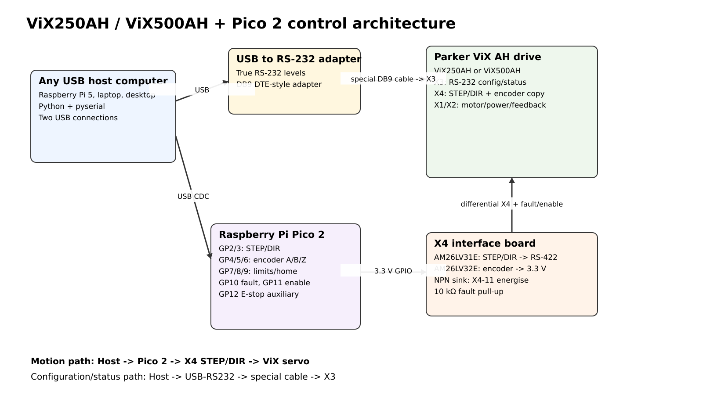
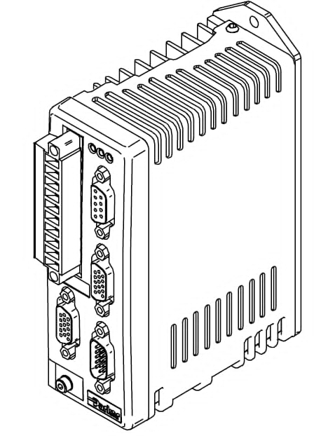
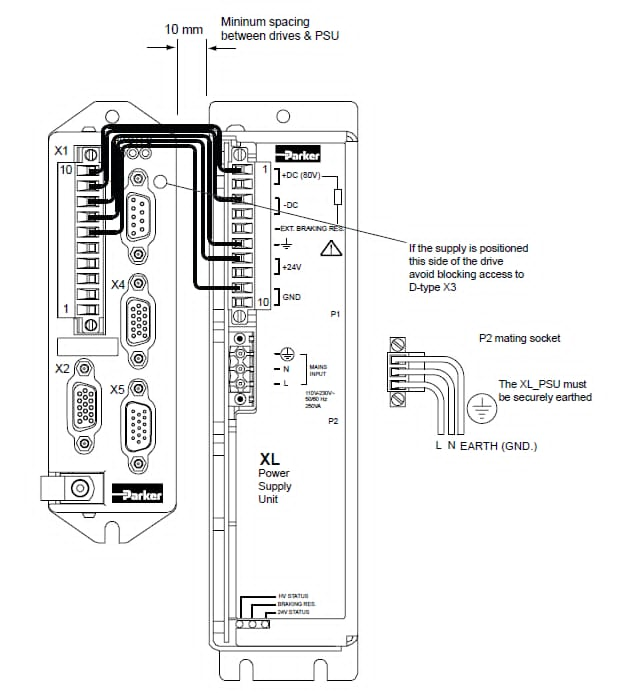
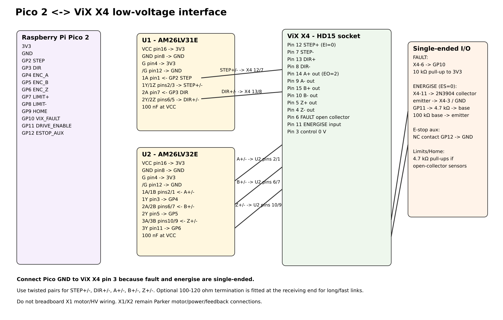

# Hardware and wiring

## 1. System architecture



There are **two independent USB paths** from the host computer:

```text
Host computer
├── USB -> Pico 2
│          └── X4 interface -> ViX STEP/DIR, encoder copy, fault, energise
└── USB -> true USB-to-RS232 adapter
           └── custom 3-wire DB9 cable -> ViX X3
```

The host can be a Raspberry Pi 5 or any practical computer with USB and Python 3. The Pico does **not** replace X3 serial communication: X3 is used to configure/query the ViX, while the Pico supplies the externally commanded motion path through X4.

## Physical drive reference

The original ViX document included these Parker reference figures for identifying the drive and XL supply arrangement:





Use these only as physical/reference illustrations; follow the Parker manual for X1 high-voltage/motor wiring and protective-earth requirements.

## 2. What connects to X4

The ViX X4 connector provides the signals needed by this project when the drive is configured for external STEP/DIR and encoder-copy output:

- differential STEP input;
- differential DIR input;
- differential A/B/Z encoder-copy outputs;
- open-collector fault output;
- active-low energise input when `ES=0`;
- control 0 V.

See the exact [X4 pin table](../hardware/connector-pinouts.md#vix-x4---stepdir-encoder-copy-fault-and-energise).



## 3. Why line-interface ICs are used

Pico GPIO must not be wired directly to the differential X4 STEP/DIR or A/B/Z pairs. The interface uses:

- **U1 AM26LV31E** as the 3.3 V differential driver for STEP and DIR;
- **U2 AM26LV32E** as the 3.3 V differential receiver for A, B, and Z.

The parts and their local datasheets are listed in [`../hardware/bom.md`](../hardware/bom.md).

### STEP/DIR path

```text
Pico GP2 STEP -> U1 -> X4 STEP+ / STEP-
Pico GP3 DIR  -> U1 -> X4 DIR+  / DIR-
```

### Encoder-copy path

```text
X4 A+ / A- -> U2 -> Pico GP4
X4 B+ / B- -> U2 -> Pico GP5
X4 Z+ / Z- -> U2 -> Pico GP6
```

### ViX fault input to Pico

X4 fault is treated as an open-collector signal. The project uses a **10 kΩ pull-up to 3.3 V** at the Pico side:

```text
healthy: ViX transistor sinks -> GP10 raw 0
fault:   output releases      -> pull-up -> GP10 raw 1
```

Do not pull this node above the Pico's 3.3 V logic rail.

### Hardware energise

With `ES=0`, X4 pin 11 must be pulled low to permit energisation. GP11 therefore drives an NPN transistor rather than wiring the Pico directly to X4-11:

```text
GP11 LOW  -> transistor OFF -> X4-11 released -> hardware disabled
GP11 HIGH -> transistor ON  -> X4-11 low      -> hardware enabled
```

Use a 4.7 kΩ base resistor and a 100 kΩ base-emitter pull-down so the default/reset state remains disabled.

## 4. Limits, home and E-stop

The included firmware assigns:

```text
GP7  positive limit
GP8  negative limit
GP9  home
GP12 E-stop auxiliary input
```

The archived MX80L test machine used open-collector stage sensors and a normally-closed E-stop auxiliary loop. **Do not assume those polarities for another machine.** Verify inactive and active raw states physically before setting `CONFIRM_INPUTS 1`.

For the tested MX80L setup, the negative limit was unavailable and firmware policy used `HAS_LN=0`. That limitation is an example-machine condition, not a requirement of ViX250AH/500AH.

## 5. Construction choices

### Solderless breadboard

Use one SOIC-16-to-DIP-16 breakout for U1 and one for U2. Solder the ICs to the adapters and plug the adapters across the breadboard center gap. Keep differential pair wiring short and paired.

### Adapter-board-only wiring

A separate breadboard or perfboard is **not required**. You may:

1. solder each SOIC IC to a SOIC-16-to-DIP-16 adapter;
2. solder Pico/X4 wires directly to the adapter's 0.1-inch through-holes;
3. add the 100 nF capacitor across VCC/GND directly on the adapter;
4. insulate the finished assembly with heat-shrink or place it in an enclosure.

This is convenient for a one-off cable interface.

### Perfboard

Use the DIP-adapter boards as modules on perfboard. Add a header for the Pico and screw terminals or a cabled HD15 male for X4.

### PCB

The KiCad schematic under [`../hardware/schematic/`](../hardware/schematic/) is the electrical starting point. On a PCB, place U1/U2 and their 100 nF capacitors near the X4 connector and route each differential pair together. Optional termination footprints are useful for longer/noisier cable runs.

## 6. X1 and X2 are deliberately outside this breadboard interface

This repository does not encourage hand-wiring the ViX high-voltage/motor path. X1 motor/power and X2 feedback connections must follow the Parker manual and the correct motor/feedback harness for the attached motor. The local manual is [`../datasheets/Parker_ViX_AH_User_Guide.pdf`](../datasheets/Parker_ViX_AH_User_Guide.pdf).
