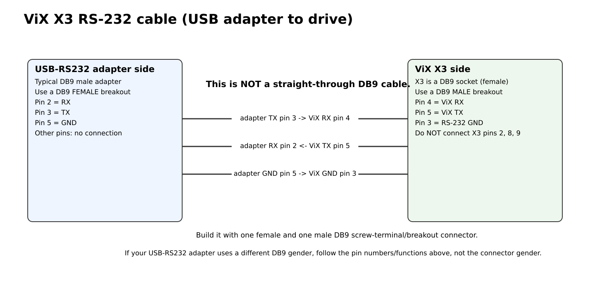

# ViX X3 serial connection and custom DB9 cable

## 1. Host-side equipment

You need:

- any USB-capable host computer (Raspberry Pi 5, laptop, desktop, mini PC, etc.);
- a **true USB-to-RS232 adapter** that produces RS-232 electrical levels;
- the custom three-wire DB9 cable described below;
- a second USB cable for the Pico 2.

A USB-to-TTL/UART adapter is **not** the same thing as USB-to-RS232 and should not be connected directly to X3.

## 2. Why a special cable is required

ViX X3 is a DB9-style 9-way D-sub socket, but its RS-232 pins are not arranged like a standard PC serial DB9. Therefore a normal straight-through DB9 extension cable is not the documented connection.



For a standard PC-style USB-RS232 adapter whose DB9 uses pin 3 as TX, pin 2 as RX, and pin 5 as signal ground:

| USB-RS232 DB9 | Direction | ViX X3 |
|---|---|---|
| pin 3 TX | → | pin 4 RX |
| pin 2 RX | ← | pin 5 TX |
| pin 5 GND | — | pin 3 RS-232 GND |

Only these three conductors are required for a single-drive connection.

## 3. Easy cable build using two breakouts

For the common USB-RS232 adapter with a **male DB9** plug:

- use a **female DB9 screw-terminal/breakout** on the adapter side;
- use a **male DB9 screw-terminal/breakout** on the ViX side because X3 on the drive is a socket;
- connect only three wires:

```text
female breakout pin 3  -> male breakout pin 4
female breakout pin 2  -> male breakout pin 5
female breakout pin 5  -> male breakout pin 3
```

Label both ends before closing the cable. Continuity-check every pin with a multimeter before plugging it into the drive.

If your particular USB-RS232 adapter has a different connector gender, change only the mechanical mating arrangement; preserve the **signal-to-X3 mapping** above.

## 4. X3 pins to leave alone

For this project:

| X3 pin | Action |
|---:|---|
| 1 | no connection |
| 2 | **do not connect** during normal operation; this is associated with drive reset/mode behavior |
| 3 | RS-232 ground — use |
| 4 | RS-232 receive — use |
| 5 | RS-232 transmit — use |
| 6 | no connection |
| 7 | D-loop transmit — not needed for a single drive |
| 8 | **do not connect** |
| 9 | +5 V output — no connection |

## 5. Serial settings

The included host software uses:

```text
9600 baud
8 data bits
no parity
1 stop bit
no flow control
```

ViX commands are ASCII and are terminated by a carriage return (`\r`). The software axis address prefixes the command; for example, with axis address 1 the revision query is sent as `1R(RV)\r`.

The tested machine used axis address 2, but the CLI defaults to 1 because that is a common single-drive configuration. Always query/confirm the actual drive address and pass `--axis` explicitly when needed.

## 6. Linux device names

Typical Linux enumeration is:

```text
/dev/ttyUSB0   USB-to-RS232 adapter -> ViX X3
/dev/ttyACM0   Pico 2 native USB CDC
```

These names can change after reconnecting hardware. Use `ls -l /dev/ttyUSB* /dev/ttyACM*` or stable udev symlinks if this will become a permanent machine.
